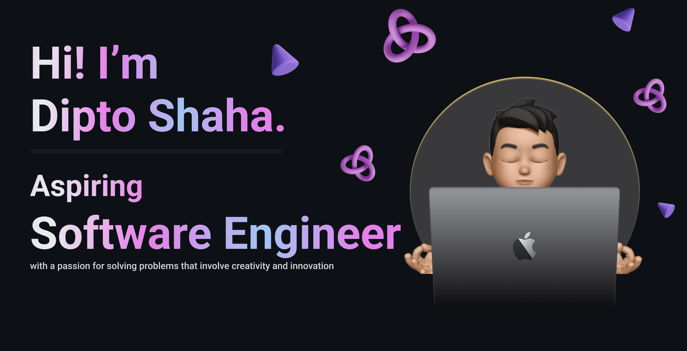

## Technologies that I know

  <table>
    <tr>
      <td align="center"></td>
      <td align="center"></td>
      <td align="center"></td>
      <td align="center"></td>
      <td align="center"></td>
      <td align="center"></td>
      <td align="center"></td>
      <td align="center"></td>
      <td align="center"></td>
      <td align="center"></td>
      <td align="center"></td>
    </tr>
    <tr>
      <td align="center">Next.js</td>
      <td align="center">React</td>
      <td align="center">Redux</td>
      <td align="center">FastAPI</td>
      <td align="center">Node.js</td>
      <td align="center">MongoDB</td>
      <td align="center">CSS</td>
      <td align="center">Tailwind</td>
      <td align="center">HTML</td>
      <td align="center">Firebase</td>
      <td align="center">Express</td>
    </tr>
  </table>

## Programming Languages:

  

# Current overview
- 🔭 I am currently a CSE undergraduate at the University of Dhaka.
- 🌱 I’m currently learning System Design
- 👯 I’m looking to collaborate on open source project
- 💬 Love to talk about technology

## Current Stats

  

  

